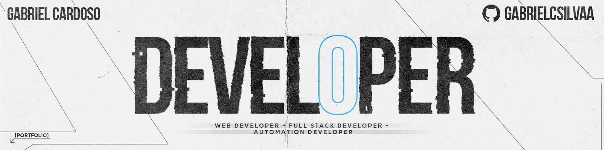
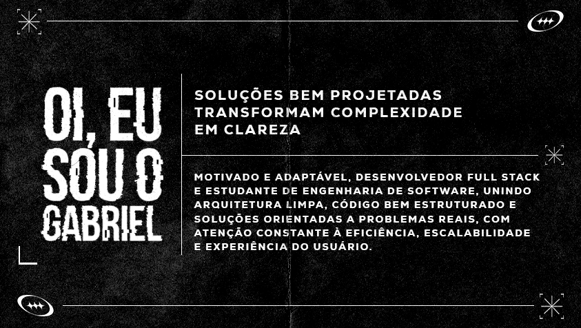

<!-- ===== BANNERS / ARTES ===== -->
<table align="center" width="100%" style="margin: 0 auto;">
  <tr>
    <td style="border: 3px solid #00ffc8; border-radius: 10px; padding: 8px; background: #111;">
      
    </td>
  </tr>

  <tr>
    <td style="border: 3px solid #00ffc8; border-radius: 10px; padding: 8px; background: #111;">
      
    </td>
  </tr>

  <tr>
    <td style="border: 3px solid #00ffc8; border-radius: 10px; padding: 8px; background: #111;">
      
    </td>
  </tr>

  <tr>
    <td style="border: 3px solid #00ffc8; border-radius: 10px; padding: 8px; background: #111;">
      
    </td>
  </tr>
</table>

 

<!-- ===== CONTACT ===== -->
## 🌐 Onde me encontrar

